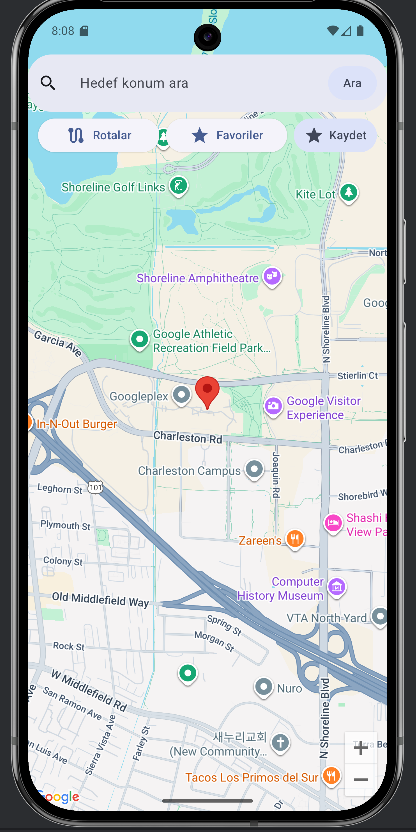
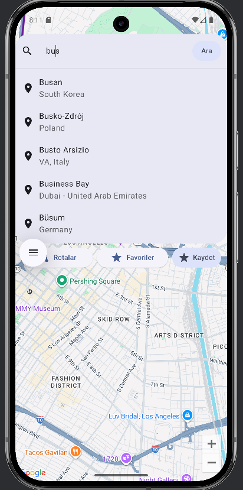
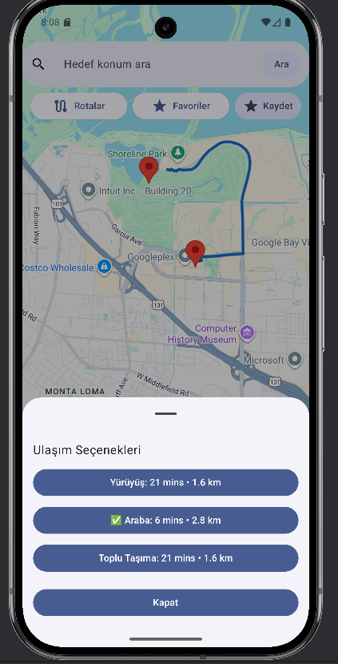
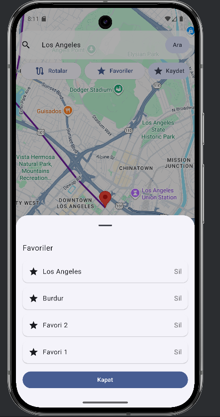

# ArdaMapp

**ArdaMapp**, Android (Jetpack Compose) ile geliştirilmiş,  
Google Maps tabanlı bir **rota planlama ve konum yönetimi** uygulamasıdır.

Uygulama; kullanıcının mevcut konumunu alır, hedef belirlemesine olanak tanır ve  
**Yürüyüş / Araba / Toplu Taşıma** seçenekleriyle rota bilgilerini gösterir.

## Özellikler

Mevcut konumu alma ve haritada gösterme
Google Places Autocomplete ile hedef arama
Haritaya tıklayarak hedef seçme
Yürüyüş, araba ve toplu taşıma için rota oluşturma
Süre ve mesafe bilgisi gösterimi
Polyline ile rota çizimi
Favori konum ekleme / silme
Favorileri DataStore ile kalıcı olarak saklama
İnternet bağlantısı kontrolü

## Kullanılan Teknolojiler

- **Kotlin**
- **Jetpack Compose (Material 3)**
- **Google Maps Compose**
- **Google Places SDK**
- **Google Directions API**
- **Google Play Services Location**
- **Retrofit & Gson**
- **Kotlin Coroutines**
- **DataStore (Preferences)**

## Kurulum

### Gereksinimler
- Android Studio (güncel sürüm)
- Android SDK
- İnternet bağlantısı
- Google Cloud Console hesabı
-  Google API Ayarları

Google Cloud Console üzerinden aşağıdaki servisler aktif edilmelidir:

- Maps SDK for Android
- Places API
- Directions API
Daha sonra bir **API Key** oluşturulmalıdır.
## API Key Tanımlama
Bu projede API anahtarı güvenlik sebebiyle **koda yazılmamıştır**.
### local.properties (Önerilen)
Proje kök dizinindeki `local.properties` dosyasına aşağıdaki satırı ekleyin:
```properties
MAPS_API_KEY=YOUR_API_KEY_HERE

## Uygulamayı Çalıştırma

1. Projeyi Android Studio ile açın
2. Gradle senkronizasyonunu bekleyin
3. Emülatör veya fiziksel cihaz seçin
4. Run ▶️ butonuna basın
5. Konum iznini verin

## Kullanım

1. Uygulama açıldığında mevcut konum otomatik alınır
2. Hedef:
   - Arama çubuğundan yazılarak
   - Google önerilerinden seçilerek
   - Haritaya tıklanarak belirlenebilir
3. "Rotalar" butonu ile ulaşım modu seçilir
4. "Kaydet" ile hedef favorilere eklenir
5. "Favoriler" ekranından kayıtlı konumlar görüntülenir

## Veri Saklama

Favori konumlar, Android **DataStore (Preferences)** kullanılarak
JSON formatında cihaz üzerinde saklanır.

## Ekran Görüntüleri

### Ana Harita


### Arama Önerileri (Google Places)


### Rota Seçenekleri


### Favoriler


### Kullanılan Kütüphaneler – Özet

- **Jetpack Compose (Material 3)**  
  Uygulamanın tüm kullanıcı arayüzü Compose mimarisi ile oluşturulmuştur.

- **Google Maps Compose**  
  Harita gösterimi, marker yerleştirme ve polyline çizimi için kullanılmıştır.

- **Google Places SDK**  
  Kullanıcının yazdığı konuma göre otomatik öneriler (autocomplete) sunmak için kullanılmıştır.

- **Google Directions API**  
  Yürüyüş, araba ve toplu taşıma modları için rota, süre ve mesafe bilgisi almak amacıyla kullanılmıştır.

- **Google Play Services Location**  
  Cihazın mevcut konumunu (enlem/boylam) almak için kullanılmıştır.

- **Retrofit & Gson**  
  Directions API ile yapılan HTTP isteklerini gerçekleştirmek ve JSON veriyi parse etmek için kullanılmıştır.

- **Kotlin Coroutines**  
  Ağ istekleri ve asenkron işlemleri ana iş parçacığını bloklamadan yürütmek için kullanılmıştır.

- **DataStore (Preferences)**  
  Favori konumların cihaz üzerinde kalıcı olarak saklanması için kullanılmıştır.

## Lisans

Bu proje eğitim ve staj amacıyla geliştirilmiştir.


